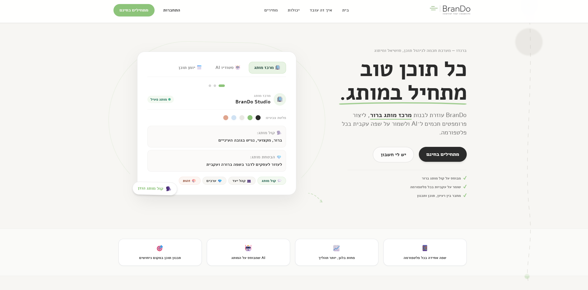
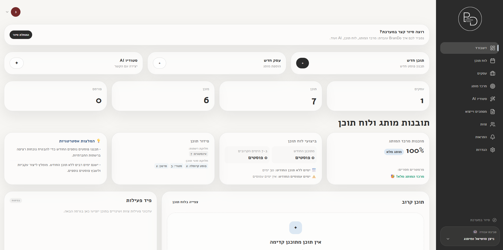
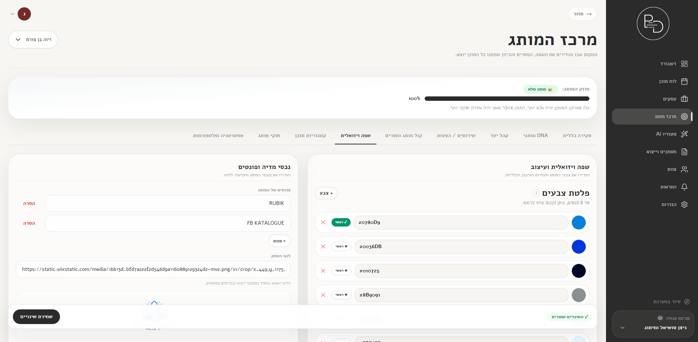
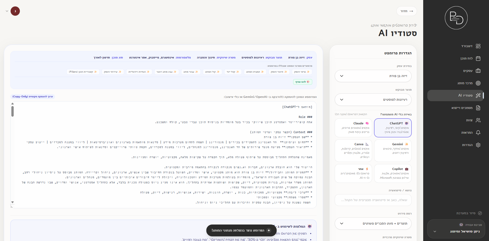
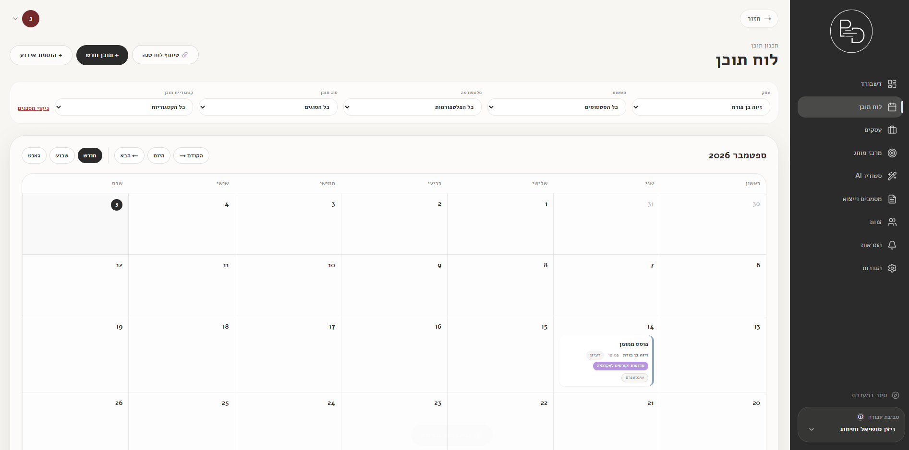
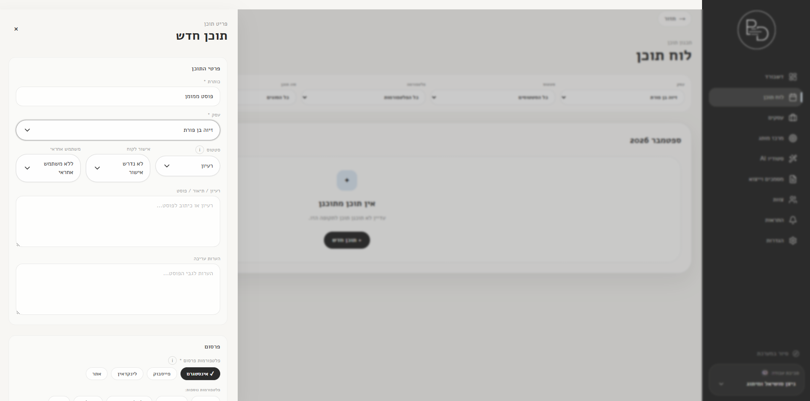
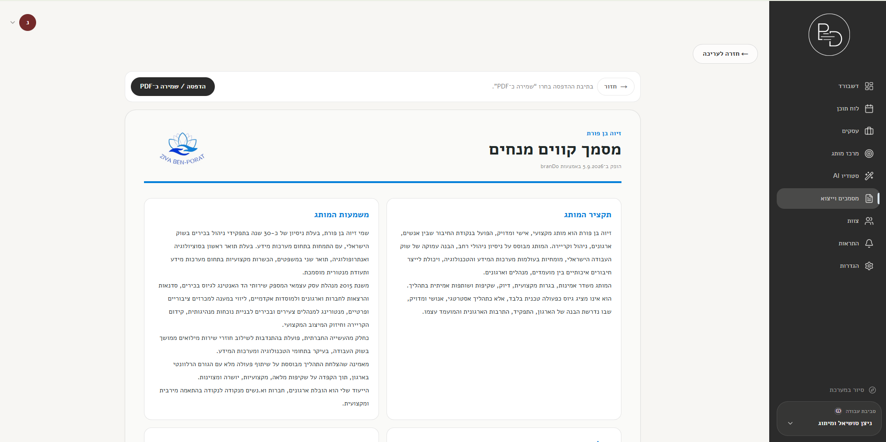

# BranDo | Brand Strategy, Content Planning & AI-Assisted SaaS

BranDo is a **live SaaS product** for managing brand strategy, content planning, collaboration, approvals, exports, subscriptions, and AI-assisted workflows from one workspace.

I built BranDo around a product problem I repeatedly saw in content and brand work: important brand context is usually scattered between documents, chats, notes, calendars, and AI prompts. BranDo turns that fragmented process into one structured system.

> **Portfolio showcase:** this repository is a curated and sanitized product case study based on the private production codebase. Production credentials, customer data, operational scripts, database repair tooling, and deployment configuration are intentionally excluded.

<p align="center">
  
</p>

## Product at a glance

**Primary users:** social media managers, content professionals, brand consultants, small teams, and businesses managing one or more brands.

**Core product goal:** keep brand strategy, content execution, collaboration, and AI-assisted work connected to the same source of truth.

The main product loop is:

```text
Set up the brand
      ↓
Plan content
      ↓
Create / refine
      ↓
Review and collaborate
      ↓
Export / publish / reuse
      ↓
Learn from the next cycle
```

## Product preview

### Workspace dashboard



The dashboard brings together brand readiness, content activity, planning signals, and practical next actions. The goal is to help users understand what needs attention without opening multiple tools.

### Brand Hub and Studio AI

<p align="center">
  
  
</p>

The **Brand Hub** acts as the product's source of truth. Brand voice, audiences, services, visual language, content pillars, key messages, platform preferences, and restrictions are stored as structured data.

**Studio AI** reuses that context so users do not have to rebuild their brand brief every time they work with an AI tool.

### Content planning and editing

<p align="center">
  
  
</p>

The calendar is designed as an operational workspace rather than a passive schedule. Content can be filtered, created, reviewed, updated, and connected to the business and platform context it belongs to.

### Branded outputs



Structured brand and content data can be reused in printable documents and business-facing exports instead of being recreated manually.

For a feature-by-feature walkthrough, see [`docs/PRODUCT_WALKTHROUGH.md`](docs/PRODUCT_WALKTHROUGH.md).

## My role

I led BranDo from product definition through launch and continue to manage its direction and iteration.

My work includes:

- defining the product problem, target workflows, feature priorities, and product structure;
- designing the information architecture and Hebrew / RTL user experience;
- mapping complex brand-management processes into clear user flows;
- designing Brand Hub, content planning, collaboration, permissions, subscriptions, and AI-assisted workflows;
- making product decisions around progressive disclosure, permissions, empty states, feature gating, and cross-feature consistency;
- building the full-stack product in Next.js, React, TypeScript, Supabase, and PostgreSQL;
- integrating authentication, authorization, subscriptions, Google Calendar, exports, and PWA behavior;
- testing, debugging, reviewing security boundaries, and iterating after real product use.

The technical depth of the project helps me make better product decisions, but the core of my work is defining **what the system should do, for whom, and how the experience should work end to end**.

## Product and UX decisions

### One source of truth for brand context

A core product decision was to avoid treating brand information as one long free-text brief. BranDo breaks it into structured, reusable fields so the same context can support planning, AI workflows, exports, and collaboration.

### Complexity without overwhelming the user

The platform contains businesses, roles, content, approvals, brand strategy, AI workflows, quotas, integrations, and exports. The UX challenge was to keep those systems connected without exposing the full underlying complexity on every screen.

### AI as part of the workflow, not a separate destination

Instead of adding a generic chatbot, Studio AI is grounded in the user's Brand Hub. This makes AI-assisted work part of the product model rather than an isolated feature.

### Permissions as a product experience

Different users may own a workspace, edit full brands, create only content, or review work. Permissions therefore affect navigation, actions, editing states, exports, integrations, and team flows, not only backend access.

### Hebrew-first SaaS UX

BranDo was designed for a Hebrew and RTL environment across desktop and mobile. Layout direction, component behavior, hierarchy, forms, modals, calendars, and generated documents all had to work naturally in RTL rather than being translated after the fact.

## Core product areas

- Multi-business workspaces
- Structured Brand Hub
- Content calendar and planning
- Content creation and editing
- Comments and approval flows
- Studio AI and brand-grounded prompt workflows
- Team roles and business-level access
- Free / Pro subscriptions and usage limits
- Google Calendar integration
- Branded documents and exports
- Notifications and operational feedback
- Responsive PWA experience
- Hebrew / RTL interface

## Product system

BranDo is multi-tenant at two levels:

```text
Workspace
   ├── Business A
   ├── Business B
   └── Business C

User access = workspace role + business scope
```

This product model allows a single workspace to manage multiple brands while still supporting users who should only see specific businesses.

See [`docs/AUTHORIZATION_MODEL.md`](docs/AUTHORIZATION_MODEL.md).

## Technical architecture

```text
User / Team
    ↓
Next.js application
    ↓
Feature workflows
    ├── Brand Hub
    ├── Content Calendar
    ├── Studio AI
    ├── Team & Permissions
    ├── Billing / Entitlements
    └── Integrations
    ↓
Application services + React Query
    ↓
Supabase / PostgreSQL / RLS / RPCs
```

See [`docs/ARCHITECTURE.md`](docs/ARCHITECTURE.md).

## Selected technical decisions

### Structured brand context

A shared completion model evaluates whether brand context is sufficiently complete for downstream workflows. See [`code-samples/brand/brand-completion.ts`](code-samples/brand/brand-completion.ts).

### Brand-grounded AI workflows

Brand data is normalized before being used for task-specific prompt logic, platform instructions, and relevance constraints. See [`docs/AI_CONTENT_SYSTEM.md`](docs/AI_CONTENT_SYSTEM.md) and [`code-samples/ai/brand-context.ts`](code-samples/ai/brand-context.ts).

### Multi-tenant authorization

BranDo distinguishes between `owner`, `full_editor`, `content_editor`, and `viewer`. UI capabilities are reinforced by PostgreSQL Row Level Security and scoped membership rules.

### Subscription enforcement

Free / Pro entitlements are enforced beyond UI visibility. Usage-sensitive features can also be constrained through database quotas, triggers, RPCs, and read-only subscription state.

### Security iteration

The private production project has gone through repeated security and permission reviews covering RLS scope, authentication, OAuth state integrity, approval boundaries, exports, schema drift, and development / production parity.

See [`docs/SECURITY_ENGINEERING.md`](docs/SECURITY_ENGINEERING.md).

## Tech stack

- **Next.js 16**
- **React 19**
- **TypeScript**
- **Supabase / PostgreSQL / Row Level Security**
- **TanStack React Query**
- **Tailwind CSS**
- **Lucide React**
- **Google OAuth / Calendar integration**
- **PWA**
- **Hebrew / RTL UI**

## Code samples

This showcase contains selected, sanitized modules from the private codebase:

- [`brand-completion.ts`](code-samples/brand/brand-completion.ts) - shared brand-readiness logic.
- [`brand-context.ts`](code-samples/ai/brand-context.ts) - normalization of structured brand data for AI workflows.
- [`role-capabilities.ts`](code-samples/authorization/role-capabilities.ts) - application-level capability model.
- [`oauth-state.ts`](code-samples/security/oauth-state.ts) - signed, short-lived OAuth state verification.

The samples are intentionally limited. This repository is not a deployable copy of the private production application.

## Product status

**BranDo is a live product.** The production system is running and continues to receive product, UX, performance, security, and feature improvements.

This public repository is a curated portfolio surface. The private production repository remains the canonical implementation.

## Security and repository scope

This repository intentionally excludes:

- `.env` files and real credentials;
- Supabase project identifiers and production secrets;
- payment-provider credentials;
- Google client secrets;
- customer / workspace data beyond intentionally selected product screenshots;
- destructive database scripts;
- production migration history;
- scratch / diagnostic tooling;
- internal operational artifacts;
- deployment-only configuration.

---

**Project:** BranDo  
**Status:** Live product  
**Focus:** Product management · UI/UX · SaaS product design · full-stack execution
